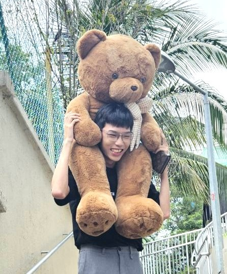
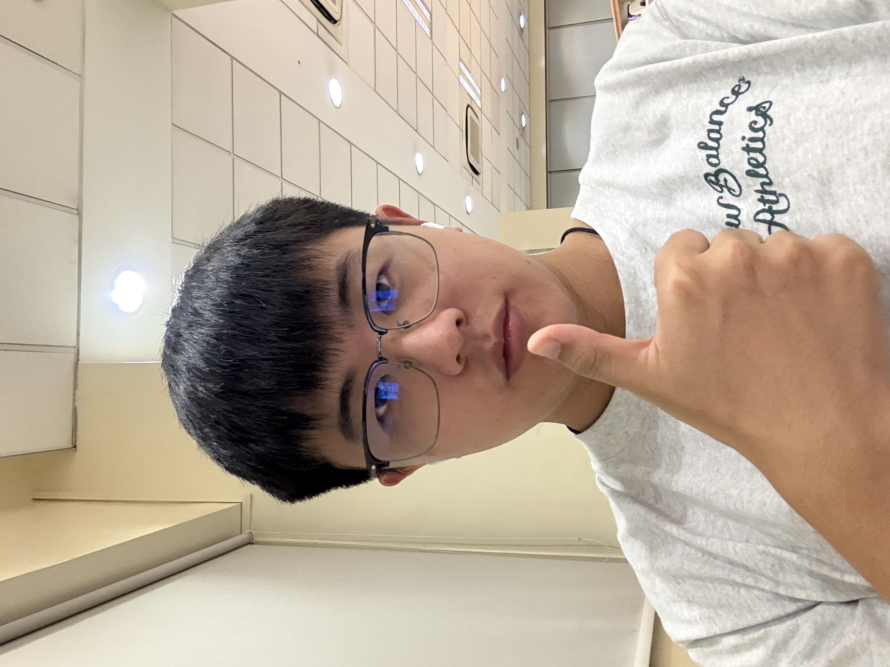
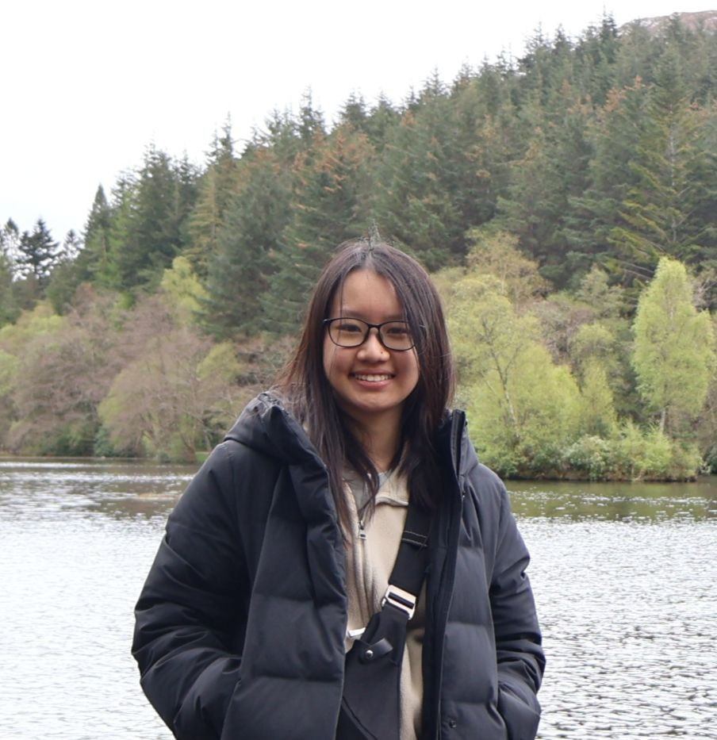

# About Us

We are a team based in the [School of Computing, National University of Singapore](http://www.comp.nus.edu.sg).

You can reach us at the email `seer[at]comp.nus.edu.sg`

## Project team

### Casey Low

[[homepage](https://kin-chong.github.io/casey-website/)]
[[github](https://github.com/kin-chong)]
[[portfolio](team/kin-chong.md)]

* Role: Project Advisor

### Aiden Ma JiaYi

[[github](http://github.com/mjykxz17)]
[[portfolio](team/Aiden.md)]

* Role: Team Lead
* Responsibilities: UI

### Ng Meng Jie

[[github](http://github.com/pokedot)] [[portfolio](team/pokedot.md)]

* Role: Developer
* Responsibilities: Data

### Ho Pei Ling

[[github](http://github.com/plingplingshiny)]

* Role: Developer
* Responsibilities: Dev Ops + Threading
