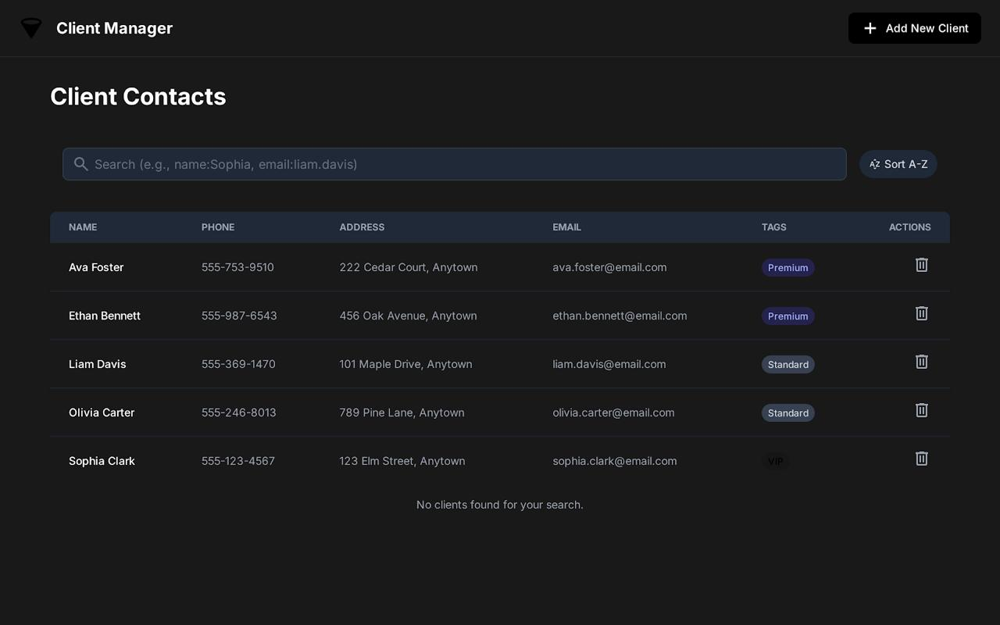
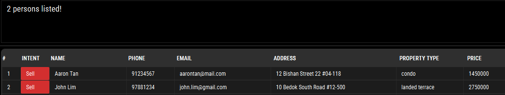

# 🏠 PropertyPal User Guide

PropertyPal is a **desktop application** that helps **real estate agents** manage their client information and preferences efficiently. It offers tools to **store**, **search**, and **organize** client information — such as names, contact details, preferred areas, and property types — all in one place.

<!-- * Table of Contents -->
<page-nav-print />

--------------------------------------------------------------------------------------------------------------------

## Quick start

1. Ensure you have Java `17` or above installed in your Computer. 
   **Mac users:** Ensure you have the precise JDK version prescribed [here](https://se-education.org/guides/tutorials/javaInstallationMac.html).

2. Download the latest `.jar` file from [here](https://github.com/AY2526S1-CS2103-F10-2/tp/releases).

3. Copy the file to the folder you want to use as the _home folder_ for your PropertyPal.

4. Open a command terminal, `cd` into the folder you put the jar file in, and use the `java -jar PropertyPal.jar` command to run the application. 
   A GUI similar to the below should appear in a few seconds. Note that the app contains some sample data by default. 
   

5. Type the command in the command box and press Enter to execute it. e.g. typing **`help`** and pressing Enter will open the help window. 
   Some example commands you can try:

    * `list` : Lists all contacts.

    * `add i/sell n/John Doe p/98765432 e/johnd@example.com a/John street, block 123, #01-01 pt/HDB 3 room flat pr/470000` : Adds a contact named `John Doe` to the Address Book, with the intent to sell his property.

    * `delete 3` : Deletes the 3rd contact shown in the current list.

    * `clear` : Deletes all contacts.

    * `exit` : Exits the app.

6. Refer to the [Features](#features) below for details of each command.

--------------------------------------------------------------------------------------------------------------------

## Features

<box type="info" seamless>

**Notes about the command format:** 

* Words in `UPPER_CASE` are the parameters to be supplied by the user. 
  e.g. in `add n/NAME`, `NAME` is a parameter which can be used as `add n/John Doe`.

* Items in square brackets are optional. 
  e.g `n/NAME [e/EMAIL]` can be used as `n/John Doe e/johndoe@example.com` or as `n/John Doe`.

* Items with `…`​ after them can be used multiple times including zero times. 
  e.g. `[pt/PROPERTY_TYPE]…​` can be used as ` ` (i.e. 0 times), `pt/condo`, `pt/condo pt/hdb` etc.

* Parameters can be in any order. 
  e.g. if the command specifies `n/NAME p/PHONE_NUMBER`, `p/PHONE_NUMBER n/NAME` is also acceptable.

* Extraneous parameters for commands that do not take in parameters (such as `help`, `list`, `exit` and `clear`) will be ignored. 
  e.g. if the command specifies `help 123`, it will be interpreted as `help`.

* The `find` command now supports prefix-based searches (`n/`, `p/`, `e/`, `a/`, `t/`, `i/`, `pt/`, `pr/`) instead of plain keywords.
  Prefixes specify which fields to search in. For example, `find n/Alex e/gmail` searches by name and email.

* If you are using a PDF version of this document, be careful when copying and pasting commands that span multiple lines as space characters surrounding line-breaks may be omitted when copied over to the application.
  </box>

* The `INTENTION` parameter in the `add` and `find` commands refers to the client's intention regarding property transactions, either selling or renting. This helps in categorizing clients based on their property-related goals.
  * **Accepted values:** `sell` or `rent` (lowercase only); other values, abbreviations, or synonyms are not accepted.

### Viewing help : `help`

Shows a message explaining how to access the help page.

Format: `help`

### Adding a person: `add`

Adds a person to the address book.

Format: `add i/INTENTION n/NAME p/PHONE_NUMBER e/EMAIL a/ADDRESS pt/PROPERTY_TYPE pr/PRICE [t/TAG]…​`

<box type="tip" seamless>

**Tip:** A person can have any number of tags (including 0)
</box>

Examples:
* `add n/John Doe p/98765432 e/johnd@example.com a/John street, block 123, #01-01 pt/HDB 3 room flat pr/470000`
* `add n/Betsy Crowe t/friend e/betsycrowe@example.com a/Newgate Prison pt/prison cell pr/0 p/1234567 t/criminal`

### Listing all persons : `list`

Shows a list of all persons in the address book in alphabetical order.

For persons with duplicate fields, they will be sorted alphabetically or lexicographically based on phone number, address and email respectively.

Format: `list`

### Editing a person : `edit`

Edits an existing person in the address book.

Format: `edit INDEX [i/INTENTION] [n/NAME] [p/PHONE_NUMBER] [e/EMAIL] [a/ADDRESS] [pt/PROPERTY_TYPE] [pr/PRICE]`

* Edits the person at the specified `INDEX`. The index refers to the index number shown in the displayed person list. The index **must be a positive integer** 1, 2, 3, …​
* At least one of the optional fields must be provided.
* Existing values will be updated to the input values.

Examples:
*  `edit 1 p/91234567 e/johndoe@example.com` Edits the phone number and email address of the 1st person to be `91234567` and `johndoe@example.com` respectively.

### Locating persons by prefix: `find`

Finds persons whose name, phone, email, address, intention, property type, price, or tags contain any of the given keywords.
The search is case-insensitive and uses substring matching (e.g. `ali` matches `Alice`) with the exception of the price field.

Format: `find [i/INTENTION] [n/NAME]…​ [p/PHONE_NUMBER]…​ [e/EMAIL]…​ [a/ADDRESS]…​ [pt/PROPERTY_TYPE] [pr/PRICE]`

* At least one prefix must be provided.
* You may include multiple prefixes in the same command — results are combined using OR semantics (a person matches if any field matches).
* Keywords are case-insensitive and may contain multiple words separated by spaces.
* **Price field matches the exact value.**  e.g. `find pr/36` will not list a property with price 3600
* Parameters can appear in any order.
* Apart from the price field, the search is case-insensitive. e.g `hans` will match `Hans` except for the price field.
* The order of the keywords does not matter. e.g. `Hans Bo` will match `Bo Hans`.
* Persons matching at least one keyword will be returned (i.e. `OR` search).
  e.g. `Hans Bo` will return `Hans Gruber`, `Bo Yang`
  
* Finding by Price:
  * finding with an exact value (e.g. `pr/2000`) will return contacts who match that exact value.
  * finding with a range of values (e.g. `pr/2000-3000`) will return contacts who fall within the range of values specified (inclusive).

Examples:
* `find n/Alex` — finds persons whose name contains “alex”.
* `find p/9123` — finds persons whose phone number contains “9123”.
* `find e/gmail` — finds persons whose email contains “gmail”.
* `find a/Clementi` — finds persons whose address contains “Clementi”.
* `find n/John p/9123` — finds persons whose name, phone match any of the given keywords.
  

### Deleting a person : `delete`

Deletes the specified person from the address book.

Format: `delete INDEX` or `delete n/NAME [n/NAME]... [confirm/yes]`

* Deletes a single person at the specified `INDEX`, OR one or more persons by exact `NAME`(s). Do not mix index and names in the same command.
* The index refers to the index number shown in the displayed person list. The index must be a positive integer: 1, 2, 3, …
* For deletion by name, each `NAME` must match a contact’s full name exactly (case-sensitive). If multiple contacts share the same exact name, only the first match will be deleted; use index to disambiguate.
* When deleting multiple persons by name, add `confirm/yes` to proceed. Without it, PropertyPal will first show a confirmation prompt listing the persons to be deleted.
* Deleting multiple names is all‑or‑nothing: if any given name is not found, nobody is deleted and an error listing the missing names is shown.
* Confirmation is not accepted for deletion by index (i.e. `confirm/...` is invalid with `delete INDEX`).

Examples:
* `list` followed by `delete 2` deletes the 2nd person in the address book.
* `find n/Betsy` followed by `delete 1` deletes the 1st person in the results of the `find` command.
* `delete n/John Doe` deletes the person named John Doe.
* `delete n/John Doe n/Jane Smith` shows a confirmation message listing both persons; re-run with `confirm/yes` to proceed.
* `delete n/John Doe n/Jane Smith confirm/yes` deletes both John Doe and Jane Smith.

### Clearing all entries : `clear`

Clears all entries from the address book.

Format: `clear`

### Exiting the program : `exit`

Exits the program.

Format: `exit`

### Saving the data

PropertyPal data are saved in the hard disk automatically after any command that changes the data. There is no need to save manually.

### Editing the data file

PropertyPal data are saved automatically as a JSON file `[JAR file location]/data/propertypal.json`. Advanced users are welcome to update data directly by editing that data file.

<box type="warning" seamless>

**Caution:**
If your changes to the data file makes its format invalid, PropertyPal will discard all data and start with an empty data file at the next run.  Hence, it is recommended to take a backup of the file before editing it. 
Furthermore, certain edits can cause the PropertyPal to behave in unexpected ways (e.g., if a value entered is outside the acceptable range). Therefore, edit the data file only if you are confident that you can update it correctly.
</box>

### Archiving data files `[coming in v2.0]`

_Details coming soon ..._

--------------------------------------------------------------------------------------------------------------------

## FAQ

**Q**: How do I transfer my data to another Computer? 
**A**: Install the app in the other computer and overwrite the empty data file it creates with the file that contains the data of your previous PropertyPal home folder.

--------------------------------------------------------------------------------------------------------------------

## Known issues

1. **When using multiple screens**, if you move the application to a secondary screen, and later switch to using only the primary screen, the GUI will open off-screen. The remedy is to delete the `preferences.json` file created by the application before running the application again.
2. **If you minimize the Help Window** and then run the `help` command (or use the `Help` menu, or the keyboard shortcut `F1`) again, the original Help Window will remain minimized, and no new Help Window will appear. The remedy is to manually restore the minimized Help Window.

--------------------------------------------------------------------------------------------------------------------

## Command summary

Action     | Format, Examples
-----------|----------------------------------------------------------------------------------------------------------------------------------------------------------------------
**Add**    | `add i/INTENTION n/NAME p/PHONE_NUMBER e/EMAIL a/ADDRESS pt/PROPERTY_TYPE pr/PRICE [t/TAG]…​`   e.g., `add i/sell n/James Ho p/22224444 e/jamesho@example.com a/123, Clementi Rd, 1234665 pt/HDB 3 room flat pr/470000 t/friend t/colleague`
**Clear**  | `clear`
**Delete** | `delete INDEX` or `delete n/NAME [n/NAME]... [confirm/yes]`  e.g., `delete 3` or `delete n/John Doe n/Jane Smith confirm/yes`
**Edit**   | `edit INDEX [n/NAME] [p/PHONE_NUMBER] [e/EMAIL] [a/ADDRESS] [pt/PROPERTY_TYPE] [pr/PRICE]`  e.g.,`edit 2 n/James Lee e/jameslee@example.com`
**Find**   | `find [i/INTENTION] [n/NAME]…​ [p/PHONE_NUMBER]…​ [e/EMAIL]…​ [a/ADDRESS]…​ [pt/PROPERTY_TYPE] [pr/PRICE]`  e.g., `find n/James p/9876 e/gmail a/Clementi`
**List**   | `list`
**Help**   | `help`
